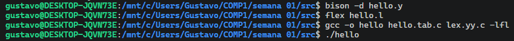
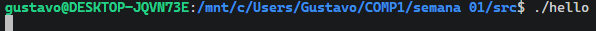
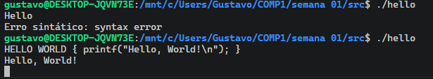

# Analisador Léxico da semana 1

## O papel do analisador léxico

O analisador léxico, desenvolvido com a ferramenta Flex, atua como a primeira fase de processamento do compilador. A responsabilidade deste módulo é ler o fluxo de texto bruto inserido pelo usuário e fatiá-lo em unidades lógicas menores, conhecidas como tokens. O analisador filtra caracteres desnecessários para a lógica do programa, como espaços em branco e quebras de linha, enviando para a próxima fase apenas as informações que possuem valor semântico.

## Como o código funciona na prática

A estrutura do arquivo principal, hello.l, é dividida em blocos de configuração e regras de transição.

A seção inicial importa as bibliotecas padrão da linguagem C e o arquivo de cabeçalho gerado pelo analisador sintático. Essa importação é um passo obrigatório para que o analisador léxico tenha conhecimento prévio dos códigos numéricos associados a cada token válido.

A segunda seção abriga a lógica de reconhecimento, baseada em expressões regulares. Quando o scanner lê a cadeia de caracteres "Hello" exata no terminal, ele aciona a devida regra e retorna o token HELLO para o sistema. O mesmo processo ocorre com a cadeia "World", retornando o token WORLD.

Uma regra fundamental nesta seção trata os espaços em branco, tabulações e quebras de linha. O comando associado a essa regra está deliberadamente vazio. Isso instrui o Flex a descartar esses caracteres sem gerar nenhum token e sem interromper a leitura do texto.

## Por que essa arquitetura é eficiente

A ferramenta Flex funciona gerando um autômato finito a partir das regras que escrevemos. Ele não interpreta o texto em tempo real, mas sim traduz as nossas expressões regulares para um arquivo na linguagem C altamente otimizado para varredura de caracteres.

Essa abordagem funciona tão bem por causa da separação de responsabilidades. O módulo léxico não tenta validar se a ordem das palavras está correta, ele apenas se preocupa em rotular o que foi digitado. A validação estrutural da frase fica a cargo do módulo sintático. Isso torna o código mais limpo, fácil de manter e muito rápido durante a execução.

## Demonstração de Execução

As imagens a seguir detalham o processo prático de compilação e o comportamento do analisador rodando no ambiente WSL.



O ambiente aguarda a entrada do texto após a invocação do executável gerado.



Após fornecer a entrada compatível com as regras léxicas, o sistema processa os tokens e finaliza a execução.
Por em quanto, a unica coisa que vai fazer algo aparecer no terminal é esse codigo:

```c
HELLO WORLD { printf("Hello, World!\n"); }
```



Para sair do programa, aperte "Ctrl" + "D"